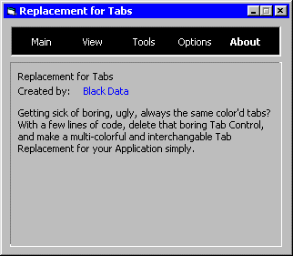



## Easy Tab Replacement

### Description

With only 6 lines of code, create an awesome new tab replacement that can be customized to any color, font and size that fits your application.
 
### More Info
 

             |
---                |---
**Submitted On**   |2001-07-18 23:16:58
**By**             |[Genosyde](https://github.com/Planet-Source-Code/PSCIndex/blob/master/ByAuthor/genosyde.md)
**Level**          |Beginner
**User Rating**    |5.0 (15 globes from 3 users)
**Compatibility**  |VB 5\.0, VB 6\.0
**Category**       |[Custom Controls/ Forms/  Menus](https://github.com/Planet-Source-Code/PSCIndex/blob/master/ByCategory/custom-controls-forms-menus__1-4.md)
**World**          |[Visual Basic](https://github.com/Planet-Source-Code/PSCIndex/blob/master/ByWorld/visual-basic.md)
**Archive File**   |[Easy Tab R230707182001\.zip](https://github.com/Planet-Source-Code/genosyde-easy-tab-replacement__1-25214/archive/master.zip)

